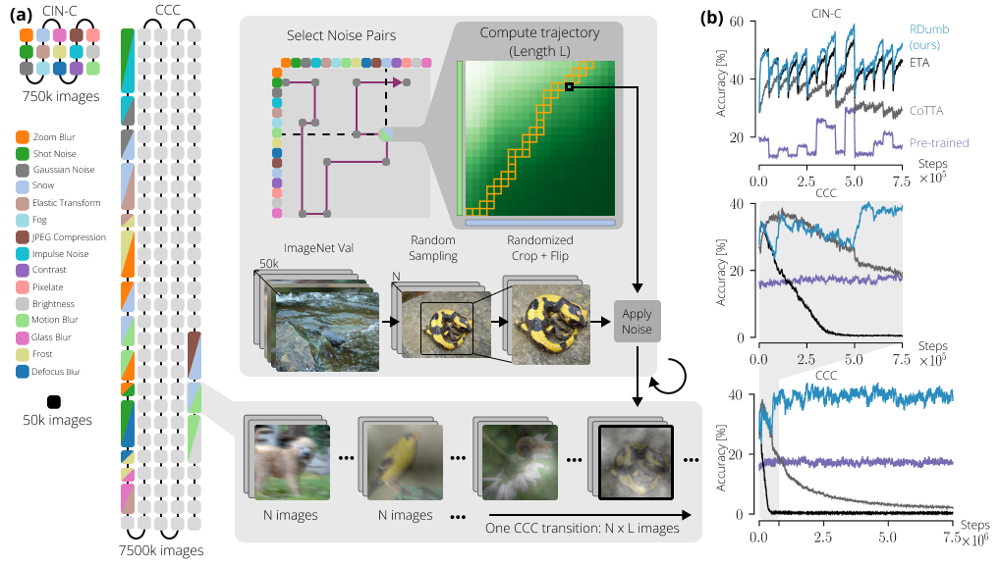

## :new: CCC can now be streamed, no download required!

By default, CCC is now streamed from the cloud, with no download or generation of the data required. For example:

``` python
import eval

dataloader = eval.get_webds_loader("baseline_20_transition+speed_1000_seed_44")
for batch in dataloader:
    # ...
```

Available datasets: `baseline_<baseline acc>_transition+speed_<speed>_seed_<seed>`

- `baseline acc`: 0, 20, 40
- `speed`: 1000, 2000, 5000
- `seed`: 43, 44, 45


# RDumb: A simple approach that questions our progress in continual test-time adaptation



This repository contains the code used in our NeurIPs 2023 [paper](https://arxiv.org/abs/2306.05401) to evaluate models on our benchmark, ***Continuously Changing Corruptions (CCC)***.
Using CCC, we are able to show that all current TTA models fail and become worse than a
pretrained, non-adapting model. We show how a very simple baseline approach sets the state
of the art not just on CCC, but on previous benchmarks as well, as well as on different
architectures.


## Dataset (Continuously Changing Corruptions)

CCC can be thought of as ImageNet-C, specifically built to evaluate continuously adapting models.
Each image in CCC is noised using 2 noises. Using 2 noises, we can keep the baseline accuracy of the dataset constant,
while enabling smooth transitions between pairs of noises.

<p align="center">
  
</p>


You do not need to generate or download the dataset; by default, it is streamed from the cloud.
The code to generate the dataset can be found in ```generate.py```. The code is parallelizable, which means that the whole
dataset can be generated quickly.

For example, you start generating using the following script:


``` bash
python3 generate.py                  \
    --imagenetval /imagenet_dir/val/ \
    --dest /destination/folder/      \
    --baseline 40                    \
    --processind 1                   \
    --totalprocesses 1
```

To use more processes, simply run the script multiple times with different proccessind arguments. Because CCC is made up of 3 seeds x 3 transition speeds,
it is recommended to use a total number of processes that is a multiple of 9. Here is an example
Slurm script that can be used to launch multiple processes:

``` bash
#!/bin/bash
#SBATCH --job-name=ccc
#SBATCH --array=0-89

singularity exec gen.sif
python3 generate.py                     \
    --imagenetval /path/to/imagenetval  \
    --dest /path/to/dest/               \
    --baseline 20                       \
    --processind ${SLURM_ARRAY_TASK_ID} \
    --totalprocesses 90                 \
```

Note: CCC-Hard, CCC-Medium, and CCC-Easy are generated with --baseline 0, 20, and 40 respectively.

## Evaluating Adaptive Models

There a few TTA methods that are avaiable to test, including ours, RDumb.
Because each difficulty level of CCC contains 3 seeds x 3 transition speeds, the evaluation code
is built to evaluate the 9 runs all at once. A sample evaluation can be ran in the following
manner:
```
python3 eval.py
--mode rdumb
--dset /path/to/ccc/
--logs /logs/folder/
--baseline 20
--processind ${SLURM_ARRAY_TASK_ID} 
```

## Citation
```
@article{press2023rdumb,
  title={RDumb: A simple approach that questions our progress in continual test-time adaptation},
  author={Press, Ori and Schneider, Steffen and K{\"u}mmerer, Matthias and Bethge, Matthias},
  journal={arXiv preprint arXiv:2306.05401},
  year={2023}
}
```


## Acknowledgements

Much of model code is based on the original [Tent](https://github.com/DequanWang/tent) and [EATA](https://github.com/mr-eggplant/EATA/) code.
The generation code is based on [ImageNet-C](https://github.com/hendrycks/robustness) code.
Other repos used: [RPL](https://github.com/bethgelab/robustness), [CPL](https://github.com/locuslab/tta_conjugate/), and [CoTTA](https://github.com/qinenergy/cotta).
A previous version of the dataset and code was published in [Shift Happens '22 @ ICML](https://github.com/shift-happens-benchmark/icml-2022).

See the [LICENSE](https://github.com/oripress/CCC/blob/main/LICENSE) for more details and licenses.
