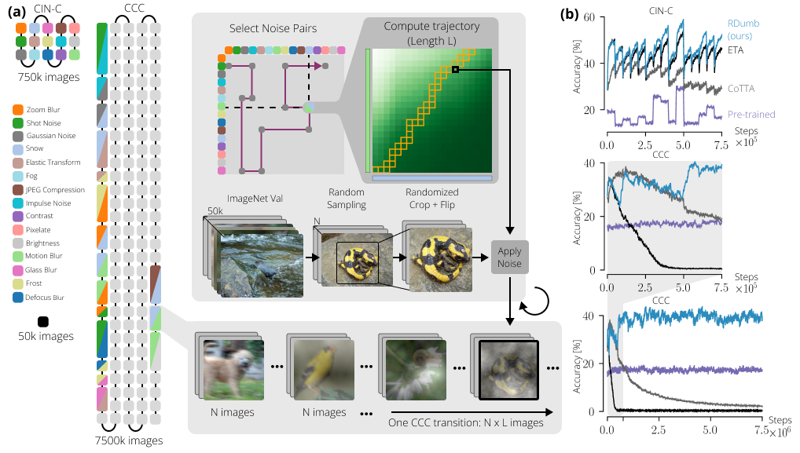
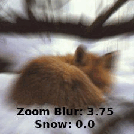

# RDumb: A simple approach that questions our progress in continual test-time adaptation



This repository contains the code used in our NeurIPs 2023 [paper](https://arxiv.org/pdf/2306.05401) to evaluate models on our benchmark, ***Continuously Changing Corruptions (CCC)***.
Using CCC, we are able to show that all current TTA models fail and become worse than a
pretrained, non-adapting model. We show how a very simple baseline approach sets the state
of the art not just on CCC, but on previous benchmarks as well, as well as on different
architectures.


## Dataset (Continuously Changing Corruptions)

CCC can be thought of as ImageNet-C, specifically built to evaluate continuously adapting models.
Each image in CCC is noised using 2 noises. Using 2 noises, we can keep the baseline accuracy of the dataset constant,
while enabling smooth transitions between pairs of noises.

<p align="center">
  
</p>


The previous hosted CCC streaming endpoint is no longer supported. Generate the
required runs locally from the ImageNet validation set with `generate.py`. The
generator is parallelizable, so different shards can be created concurrently.

The ImageNet validation directory must be extracted into one subdirectory per
class. This example generates CCC-Medium with transition speed 1000 and seed 44:

```bash
python3 generate.py                  \
    --imagenetval /path/to/imagenet/val \
    --dest /path/to/ccc                 \
    --baseline 20                       \
    --processind 3                      \
    --totalprocesses 9
```

This writes shards under
`/path/to/ccc/baseline_20_transition+speed_1000_seed_44/`. Baseline values are
written as integers, so `--baseline 20` produces `baseline_20`, not
`baseline_20.0`.

CCC uses three transition speeds and three seeds. Within each block of nine
process indices, `processind % 9` selects a run as follows:

| Index | Speed | Seed |
| ---: | ---: | ---: |
| 0 | 1000 | 43 |
| 1 | 2000 | 43 |
| 2 | 5000 | 43 |
| 3 | 1000 | 44 |
| 4 | 2000 | 44 |
| 5 | 5000 | 44 |
| 6 | 1000 | 45 |
| 7 | 2000 | 45 |
| 8 | 5000 | 45 |

`--totalprocesses` must be a multiple of 9. Values greater than 9 assign
multiple workers to each run. For example, this Slurm job assigns ten workers
to each of the nine speed and seed combinations:

```bash
#!/bin/bash
#SBATCH --job-name=ccc
#SBATCH --array=0-89

python3 generate.py                     \
    --imagenetval /path/to/imagenetval  \
    --dest /path/to/dest/               \
    --baseline 20                       \
    --processind ${SLURM_ARRAY_TASK_ID} \
    --totalprocesses 90                 \
```

CCC-Hard, CCC-Medium, and CCC-Easy are generated with `--baseline 0`,
`--baseline 20`, and `--baseline 40`, respectively.

## Evaluating Adaptive Models

There are a few TTA methods available to test, including RDumb.
Each difficulty level contains three seeds and three transition speeds. Launch
`eval.py` with process indices 0 through 8 to evaluate all nine runs. For
example, process index 3 evaluates transition speed 1000 with seed 44:

```bash
python3 eval.py                         \
    --mode rdumb                        \
    --dset /path/to/ccc                 \
    --logs /path/to/logs                \
    --baseline 20                       \
    --processind 3
```

## Citation
```
@inproceedings{
press2023rdumb,
title={{RD}umb: A simple approach that questions our progress in continual test-time adaptation},
author={Ori Press and Steffen Schneider and Matthias Kuemmerer and Matthias Bethge},
booktitle={Thirty-seventh Conference on Neural Information Processing Systems},
year={2023},
url={https://openreview.net/forum?id=VfP6VTVsHc}
}
```


## Acknowledgements

Much of model code is based on the original [Tent](https://github.com/DequanWang/tent) and [EATA](https://github.com/mr-eggplant/EATA/) code.
The generation code is based on [ImageNet-C](https://github.com/hendrycks/robustness) code.
Other repos used: [RPL](https://github.com/bethgelab/robustness), [CPL](https://github.com/locuslab/tta_conjugate/), and [CoTTA](https://github.com/qinenergy/cotta).
A previous version of the dataset and code was published in [Shift Happens '22 @ ICML](https://github.com/shift-happens-benchmark/icml-2022).

See the [LICENSE](https://github.com/oripress/CCC/blob/main/LICENSE) for more details and licenses.
